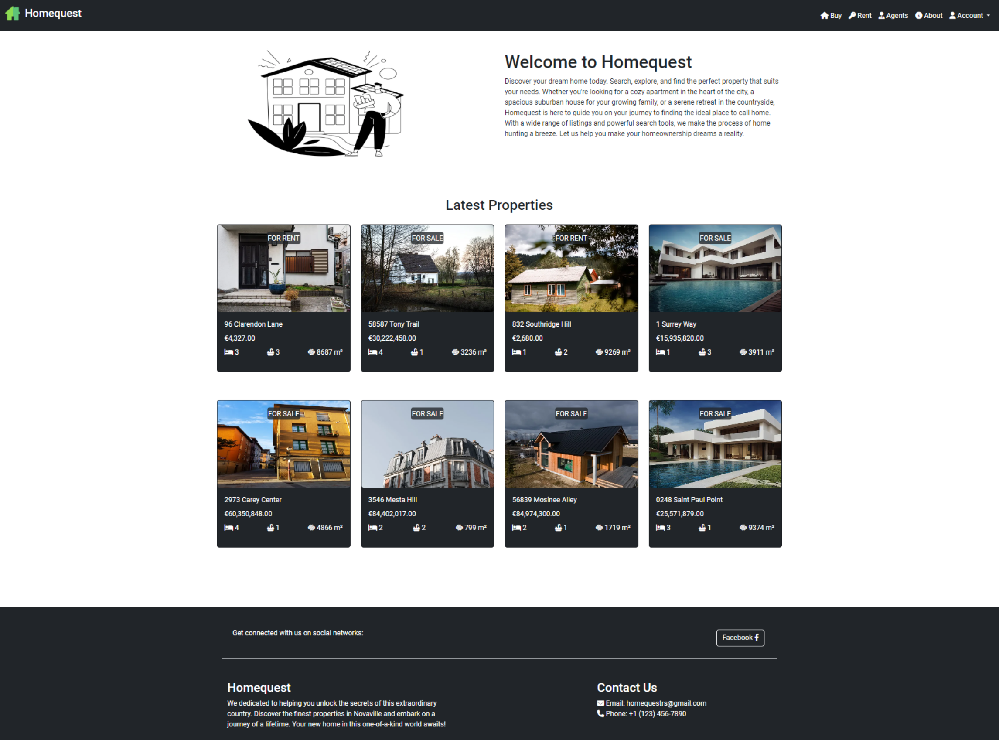
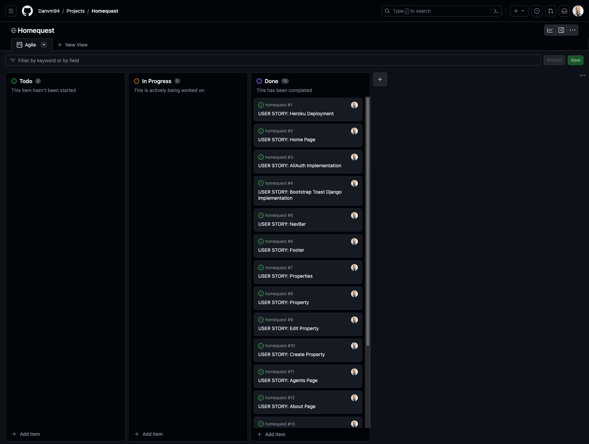
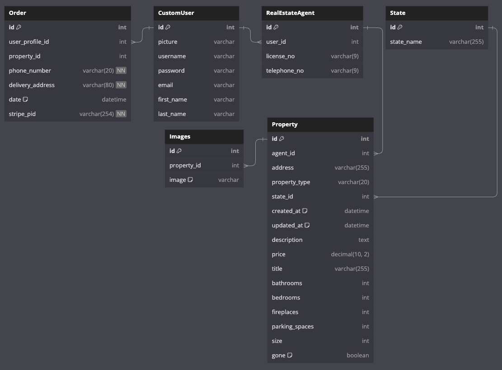

# **Homequest**

## **Overview**

HomeQuest is a sophisticated real estate platform designed to provide users
with a seamless and comprehensive experience in navigating the dynamic world of
real estate. With a user-friendly interface and robust features, HomeQuest aims
to empower individuals in their property search journey.

[Homequest Live Website](https://homequestrs-494f18176619.herokuapp.com/) (
Right-click to open in a new tab)

## **Project Goals**

This is my fifth portfolio project Welcome to HomeQuest project, showcasing
my proficiency in web (e-commerce) development frameworks like Bootstrap and
Django. With this project, I aim to highlight the effective utilization of
these skills in creating a dynamic real estate website.

This project demonstrates my ability to craft a user-friendly and feature-rich
web platform for real estate exploration. Leveraging Django and Bootstrap,
HomeQuest is designed to provide a seamless experience for users navigating the
diverse real estate market.

## **UX**

## **The Strategy Plane**

Homequest is a dynamic e-commerce platform designed to revolutionize the way
users engage with the real estate market in the fictional city of Novaville.
The strategy behind Homequest revolves around providing an immersive experience
for users to explore and discover available properties seamlessly.

## **The Ideal User**

Homequest is tailored to meet the needs of individuals who are passionate about
exploring the real estate market. The ideal users for Homequest include:

- **Property Enthusiasts:**
    - Individuals with a keen interest in discovering and exploring various
      properties.

- **Real Estate Explorers:**
    - Users who enjoy navigating through a diverse range of property listings
      to find their ideal home or investment opportunity.

- **Online Shoppers:**
    - Those comfortable with online platforms, seeking a convenient and
      user-friendly experience in exploring and purchasing properties.

- **Payment Security Seekers:**
    - Users who prioritize secure online transactions, facilitated by the
      integration of Stripe for reliable and safe payments.

- **Immersive Experience Seekers:**
    - Individuals looking for a visually appealing and immersive online
      experience while exploring the city's real estate offerings.

- **Responsive Design:**
    - Individuals who value a responsive design, ensuring a seamless experience
      across various devices, including desktop and mobile.

- **Informed Decision-Makers:**
    - Users interested in educational content about city's real estate
      market to make well-informed decisions.

## **Site Goals**

- To offer users a platform to explore properties within the city.
- To enable users to virtually navigate and experience a diverse range of
  available properties.
- To empower users with the tools to make informed decisions about property
  exploration and investment.
- To provide users with access to comprehensive and up-to-date information
  about city's real estate market.
- To create a secure and user-friendly environment for exploring and
  potentially purchasing properties.

- [Back to top &uarr;](#contents)

## **Agile Planning for Homequest**

This project was developed using agile methodologies, focusing on delivering
small features across the project's duration. User Stories were prioritized
under the labels "Must Have," "Should Have," and "Could Have."

This approach ensured that all essential requirements for Homequest were
addressed initially, providing a comprehensive foundation for the project. In
certain cases, some "Could Have" features were implemented ahead of schedule,
particularly if they were straightforward, such as Trending/Top Rated
Properties. Other features were integrated based on available capacity and
timing.

The project utilized a Kanban board created on GitHub projects, which can be
accessed [here](https://github.com/users/Danvm94/projects/5). This board
provided detailed information about project cards. All User Stories included a
set of acceptance criteria to define the functionality required for story
completion.

#### **Database Schema**

The database schema for this project includes the following models:

- The **Order** model stores information about orders made by users.
    - Fields:
        - `user_profile`: ForeignKey relationship with the CustomUser model.
        - `property`: ForeignKey relationship with the Property model.
        - `phone_number`: CharField for storing the user's phone number (not
          null).
        - `delivery_address`: CharField for storing the delivery address (not
          null).
        - `date`: DateTimeField for the order date (auto_now_add=True).
        - `stripe_pid`: CharField for storing the Stripe payment ID (not null).

- The **CustomUser** model represents user profiles with extended fields.
    - Fields:
        - `picture`: VarcharField for storing the user's profile picture.
        - Additional fields inherited from the AbstractUser model.

- The **RealEstateAgent** model represents real estate agents linked to users.
    - Fields:
        - `user`: ForeignKey relationship with the CustomUser model.
        - `license_no`: CharField for storing the agent's license number.
        - `telephone_no`: CharField for storing the agent's telephone number.

- The **State** model stores information about states.
    - Fields:
        - `state_name`: CharField for storing the name of the state (unique).

- The **Property** model represents properties available for sale or rent.
    - Fields:
        - `agent`: ForeignKey relationship with the RealEstateAgent model.
        - `address`: CharField for storing the property address.
        - `property_type`: CharField for storing the property type (sale/rent).
        - `state`: ForeignKey relationship with the State model.
        - `created_at`: DateTimeField for creation timestamp (
          auto_now_add=True).
        - `updated_at`: DateTimeField for update timestamp (auto_now=True).
        - Additional property details, such as description, price, title, etc.

- The **Images** model represents images associated with properties.
    - Fields:
        - `property`: ForeignKey relationship with the Property model.
        - `image`: VarcharField for storing the image file path (default '').

This schema defines the structure of your project's database, facilitating the
management of user orders, profiles, real estate agents, states, properties,
and property images.

#### **Security Measures**

Security is a top priority in the development of this project. Several security
measures have been implemented to protect user data and sensitive information.

- **User Authentication**

In addition to the `@login_required` decorator, the `@user_passes_test`
decorator with a custom `is_staff` function is also employed to restrict access
to specific views. The `is_staff` function checks whether a user is a staff
member, and the `@user_passes_test(is_staff)` decorator ensures that only staff
members can access the associated views. This helps in further controlling
access to certain functionalities based on user roles.

- **Protection of Sensitive Data**

To safeguard secret keys, API keys, and other sensitive information,
environment variables have been utilized. During local development, these
variables are stored in an `env.py` file, ensuring that no confidential data is
exposed in the project repository. In the production environment (e.g., on
Heroku), these variables are securely managed through Heroku's config vars.

These security measures are in place to provide a safe and reliable user
experience while protecting sensitive information from unauthorized access.

[Back to top &uarr;](#contents)

### **The Scope Plane**

- **Responsive Design:**
    - The site should be fully functional on all devices,
      ranging from 320px width and up.

- **Hamburger Menu:**
    - Implement a mobile-friendly hamburger menu for improved
      navigation on mobile devices.

- **CRUD Functionality:**
    - For real estate agents, CRUD operations should be available for
      Properties.

- **Role-Based Access:**
    - Specifically, only real estate agents should have the ability to perform
      CRUD operations on Properties.

- **Home Page:**
    - Design a home page that provides an overview of the site's
      purpose, with convenient links to essential features for registered
      users.
