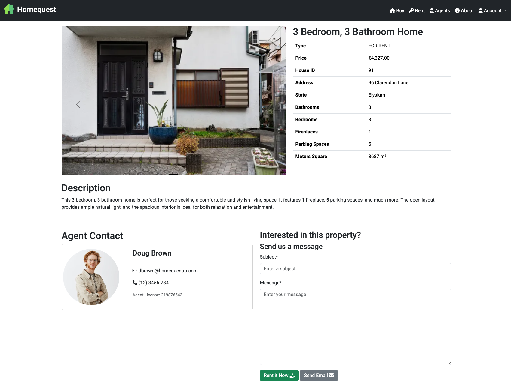
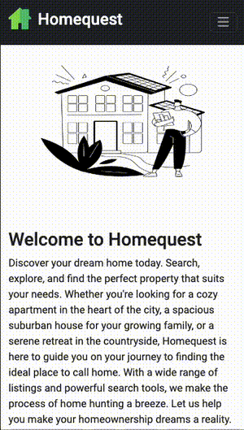
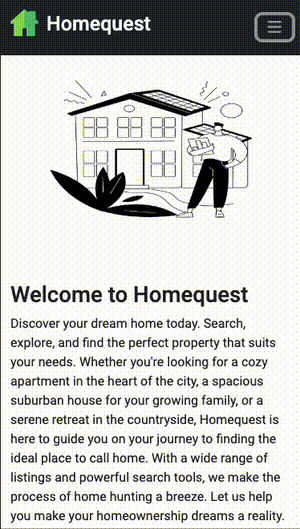
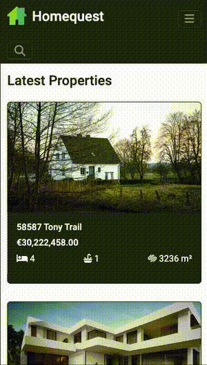
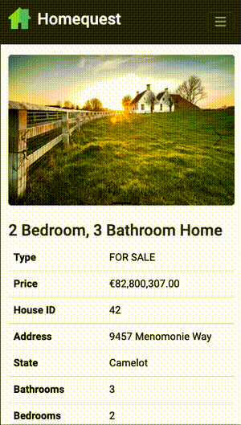
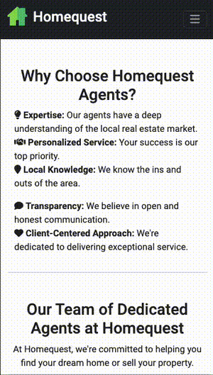
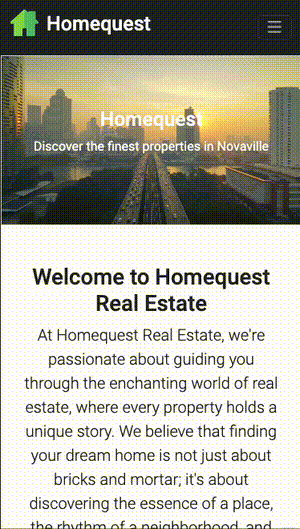
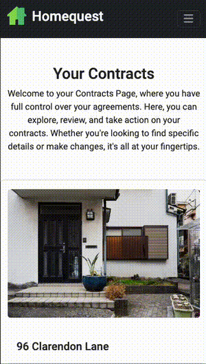
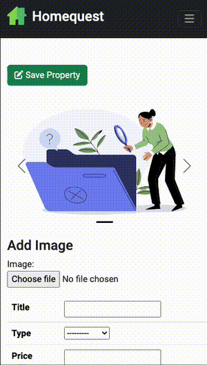
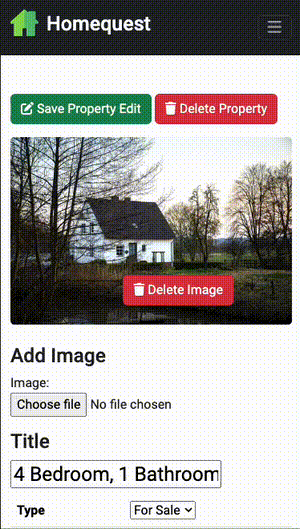

# **Homequest**

## **Overview**

HomeQuest is a sophisticated real estate platform designed to provide users
with a seamless and comprehensive experience in navigating the dynamic world of
real estate. With a user-friendly interface and robust features, HomeQuest aims
to empower individuals in their property search journey.

[Homequest Live Website](https://homequestrs-494f18176619.herokuapp.com/) (
Right-click to open in a new tab)

## **Project Goals**

This is my fifth portfolio project Welcome to HomeQuest project, showcasing
my proficiency in web (e-commerce) development frameworks like Bootstrap and
Django. With this project, I aim to highlight the effective utilization of
these skills in creating a dynamic real estate website.

This project demonstrates my ability to craft a user-friendly and feature-rich
web platform for real estate exploration. Leveraging Django and Bootstrap,
HomeQuest is designed to provide a seamless experience for users navigating the
diverse real estate market.

## **UX**

## **The Strategy Plane**

Homequest is a dynamic e-commerce platform designed to revolutionize the way
users engage with the real estate market in the fictional city of Novaville.
The strategy behind Homequest revolves around providing an immersive experience
for users to explore and discover available properties seamlessly.

## **The Ideal User**

Homequest is tailored to meet the needs of individuals who are passionate about
exploring the real estate market. The ideal users for Homequest include:

- **Property Enthusiasts:**
    - Individuals with a keen interest in discovering and exploring various
      properties.

- **Real Estate Explorers:**
    - Users who enjoy navigating through a diverse range of property listings
      to find their ideal home or investment opportunity.

- **Online Shoppers:**
    - Those comfortable with online platforms, seeking a convenient and
      user-friendly experience in exploring and purchasing properties.

- **Payment Security Seekers:**
    - Users who prioritize secure online transactions, facilitated by the
      integration of Stripe for reliable and safe payments.

- **Immersive Experience Seekers:**
    - Individuals looking for a visually appealing and immersive online
      experience while exploring the city's real estate offerings.

- **Responsive Design:**
    - Individuals who value a responsive design, ensuring a seamless experience
      across various devices, including desktop and mobile.

- **Informed Decision-Makers:**
    - Users interested in educational content about city's real estate
      market to make well-informed decisions.

## **Site Goals**

- To offer users a platform to explore properties within the city.
- To enable users to virtually navigate and experience a diverse range of
  available properties.
- To empower users with the tools to make informed decisions about property
  exploration and investment.
- To provide users with access to comprehensive and up-to-date information
  about city's real estate market.
- To create a secure and user-friendly environment for exploring and
  potentially purchasing properties.

- [Back to top &uarr;](#contents)

## **Agile Planning for Homequest**

This project was developed using agile methodologies, focusing on delivering
small features across the project's duration. User Stories were prioritized
under the labels "Must Have," "Should Have," and "Could Have."

This approach ensured that all essential requirements for Homequest were
addressed initially, providing a comprehensive foundation for the project. In
certain cases, some "Could Have" features were implemented ahead of schedule,
particularly if they were straightforward, such as Trending/Top Rated
Properties. Other features were integrated based on available capacity and
timing.

The project utilized a Kanban board created on GitHub projects, which can be
accessed [here](https://github.com/users/Danvm94/projects/5). This board
provided detailed information about project cards. All User Stories included a
set of acceptance criteria to define the functionality required for story
completion.

#### **Database Schema**

The database schema for this project includes the following models:

- The **Order** model stores information about orders made by users.
    - Fields:
        - `user_profile`: ForeignKey relationship with the CustomUser model.
        - `property`: ForeignKey relationship with the Property model.
        - `phone_number`: CharField for storing the user's phone number (not
          null).
        - `delivery_address`: CharField for storing the delivery address (not
          null).
        - `date`: DateTimeField for the order date (auto_now_add=True).
        - `stripe_pid`: CharField for storing the Stripe payment ID (not null).

- The **CustomUser** model represents user profiles with extended fields.
    - Fields:
        - `picture`: VarcharField for storing the user's profile picture.
        - Additional fields inherited from the AbstractUser model.

- The **RealEstateAgent** model represents real estate agents linked to users.
    - Fields:
        - `user`: ForeignKey relationship with the CustomUser model.
        - `license_no`: CharField for storing the agent's license number.
        - `telephone_no`: CharField for storing the agent's telephone number.

- The **State** model stores information about states.
    - Fields:
        - `state_name`: CharField for storing the name of the state (unique).

- The **Property** model represents properties available for sale or rent.
    - Fields:
        - `agent`: ForeignKey relationship with the RealEstateAgent model.
        - `address`: CharField for storing the property address.
        - `property_type`: CharField for storing the property type (sale/rent).
        - `state`: ForeignKey relationship with the State model.
        - `created_at`: DateTimeField for creation timestamp (
          auto_now_add=True).
        - `updated_at`: DateTimeField for update timestamp (auto_now=True).
        - Additional property details, such as description, price, title, etc.

- The **Images** model represents images associated with properties.
    - Fields:
        - `property`: ForeignKey relationship with the Property model.
        - `image`: VarcharField for storing the image file path (default '').

This schema defines the structure of your project's database, facilitating the
management of user orders, profiles, real estate agents, states, properties,
and property images.

#### **Security Measures**

Security is a top priority in the development of this project. Several security
measures have been implemented to protect user data and sensitive information.

- **User Authentication**

In addition to the `@login_required` decorator, the `@user_passes_test`
decorator with a custom `is_staff` function is also employed to restrict access
to specific views. The `is_staff` function checks whether a user is a staff
member, and the `@user_passes_test(is_staff)` decorator ensures that only staff
members can access the associated views. This helps in further controlling
access to certain functionalities based on user roles.

- **Protection of Sensitive Data**

To safeguard secret keys, API keys, and other sensitive information,
environment variables have been utilized. During local development, these
variables are stored in an `env.py` file, ensuring that no confidential data is
exposed in the project repository. In the production environment (e.g., on
Heroku), these variables are securely managed through Heroku's config vars.

These security measures are in place to provide a safe and reliable user
experience while protecting sensitive information from unauthorized access.

[Back to top &uarr;](#contents)

### **The Scope Plane**

- **Responsive Design:**
    - The site should be fully functional on all devices,
      ranging from 320px width and up.

- **Hamburger Menu:**
    - Implement a mobile-friendly hamburger menu for improved
      navigation on mobile devices.

- **CRUD Functionality:**
    - For real estate agents, CRUD operations should be available for
      Properties.

- **Role-Based Access:**
    - Specifically, only real estate agents should have the ability to perform
      CRUD operations on Properties.

- **Home Page:**
    - Design a home page that provides an overview of the site's
      purpose, with convenient links to essential features for registered
      users.

## **The Structure Plane**

### **Features**

#### **Navbar**

The Navbar contains links for various sections of the website, each with
specific visibility conditions:

- **Home** (index.html): Visible to all users.
- **Buy** (properties-sale): Visible to all users.
- **Rent** (properties-rent): Visible to all users.
- **Agents** (agents): Visible to all users.
- **About** (about): Visible to all users.
- **Your Contracts** (contracts_view): Visible only to logged-in users.
- **Add Property** (edit_property): Visible only to logged-in users with staff
  privileges.
- **Profile** (profile): Visible only to logged-in users.
- **Sign Out** (account_logout): Visible only to logged-in users.

These navigation items ensure that users have access to the relevant sections
based on their authentication status and roles.

[Back to top &uarr;](#contents)

#### **Footer**

The footer section is thoughtfully positioned at the bottom of each page,
providing a cohesive and user-friendly experience.

- **Social Media Links:** Social media links are elegantly displayed using
  icons from Font Awesome. These icons offer a seamless way for users to
  connect with the company, stay updated with news, and engage with the
  community.

- **Company Description:** A brief description of the company is included,
  providing users with essential information about the company's mission and
  values.

[Back to top &uarr;](#contents)

#### **Homepage**

The homepage of Homequest welcomes users with a well-structured layout
designed to provide a comprehensive experience. It's divided into two sections:

- **'Welcome Section':** The "Welcome" section serves as the initial
  introduction
  to the website. It offers a brief and inviting overview of Homequest's
  mission and purpose.
  

- **'Latest Properties':** The Latest Properties section displays the most
  recent 8 properties added to the website. This serves as a quick showcase,
  providing users with an immediate glimpse of what's happening in the
  Homequest market. Users can click on each property to access more detailed
  information, allowing them to explore features, images, and additional
  details for a comprehensive view of each listing.
  

#### **Register Page**

The 'Register' page on Homequest is where new users can create their accounts
to access the platform's features. This user-friendly page simplifies the
registration process and gathers essential information from users to get
started.

However, the primary method for registration on Homequest is through a modal.
This modal is conveniently available throughout the entire website when the
user is not logged in, serving as the main and efficient way for users to sign
up without navigating away from their current context.

In cases where registration fails or additional information is required, the
dedicated registration page serves as a showcase to guide users through the
necessary steps and provide the relevant information needed to complete the
registration process successfully.

[Back to top &uarr;](#contents)

#### **Login Page**

The 'Login' page on Homequest is where users can securely access their accounts
and explore the platform's features. This dedicated page provides a streamlined
login process, ensuring a secure and user-friendly experience.

While the dedicated login page offers a traditional login experience, the
primary and preferred method for logging in on Homequest is through a modal.
This modal is conveniently accessible throughout the entire website, providing
users with a quick and seamless way to log in without navigating away from
their current context.

In situations where login attempts fail or additional verification is
necessary, the dedicated login page is designed to guide users through the
necessary steps and communicate any pertinent information needed to
successfully log in.

[Back to top &uarr;](#contents)

#### **Buy and Rent Pages**

The 'Buy and Rent' pages on Homequest are your gateways to explore curated
selections of properties available for both sale and rent. These pages are
dedicated to showcasing properties, providing users with a convenient and
focused space for their home-searching journey.

**Key Features:**

- **Property Listings:** The 'Buy and Rent' pages exclusively feature
  properties available for each sale and rent. Users can browse through curated
  selections to find the perfect home or rental that meets their preferences
  and requirements.

- **Individual Property Details:** Clicking on each property opens a dedicated
  page with comprehensive details. Users can explore images, descriptions, and
  additional information to make informed decisions about their potential
  future home or rental.

- **Filter Functionality:** The pages include a robust filtering system,
  allowing users to narrow down their search based on specific criteria such as
  location, price range, and property type. This feature enhances the user
  experience by providing targeted results tailored to individual preferences.

- **Paginator Function:** To enhance navigation and avoid overwhelming users,
  the 'Buy and Rent' pages incorporate a paginator function. This allows the
  display of a manageable number of properties on each page, making it easy for
  users to navigate through the available listings.

Explore, filter, and find your dream home or rental seamlessly on the 'Buy and
Rent' pages of Homequest.

[Back to top &uarr;](#contents)

#### **Property View Page**

The 'Property View' page on Homequest is meticulously designed to provide
users with a comprehensive overview of individual properties and access to
key functionalities.

**Key Features:**

- **Detailed Property Information:** Access detailed information about the
  property, including its location, features, specifications, and high-quality
  images.

- **Agent Contact:** Directly connect with the responsible agent for the
  property. The 'Contact Agent' feature allows users to inquire about
  specific property details, gather additional information, or address any
  inquiries they may have.

- **Rental Process (if applicable):** For properties available for rent,
  auditors can review and understand the streamlined rental process. This
  feature provides insight into the steps involved, ensuring transparency in
  the rental agreements.

The 'Property View' page serves as a central hub for auditors to gather
essential information, make inquiries, and navigate the rental process if
needed.

[Back to top &uarr;](#contents)

#### **Agents Page**

The 'Agents' page on Homequest serves as your gateway to connect with our
experienced real estate professionals. Discover the faces behind Homequest,
each contributing a wealth of knowledge and dedication to assist you in your
real estate journey.

**Key Features:**

- **Why Choose Homequest Agents:** Get to know the core workers at Homequest.
  Our dedicated team brings expertise, reliability, and a commitment to making
  your real estate experience exceptional.

- **Meet Our Agents:** Explore the profiles of our team in the 'Meet Our
  Agents' section. Each agent is ready to guide you in finding your dream home.

This page introduces you to the agents who can help you find your ideal home.

[Back to top &uarr;](#contents)

#### **About Page**

The 'About' page on Homequest provides a window into company's journey and
values.

**Key Features:**

- **Welcome Section:** The 'Welcome' section sets the tone for your
  exploration,
  offering a warm introduction to Homequest. It serves as an inviting entry
  point, providing a glimpse into the essence of our community and the
  importance
  we place on creating meaningful homes.

- **Our Core Section:** In the 'Our Core' section, we delve into the
  fundamental
  aspects that define Homequest. This segment articulates our mission, values,
  and commitment to building a community centered around trust, transparency,
  and
  client satisfaction. It provides a deeper understanding of what drives us in
  the realm of real estate.

Explore the 'About' page to discover more about Homequest, our journey, and the
principles that shape our approach to real estate.

[Back to top &uarr;](#contents)

#### **Contracts Page**

The 'Contracts' page on Homequest serves as a central hub for users to oversee
and manage their rented properties. It consists of two main sections:

**Key Features:**

- **View Contracts Section:** In the 'View Contracts' section, users can access
  and review details of their active contracts. This area provides a
  comprehensive display of the terms,conditions, and essential information
  pertaining to rented properties.

- **Terminate Contracts Section:** Within the 'Terminate Contracts' section,
  users have the capability to initiate the termination process for active
  contracts that are no longer required. This functionality offers flexibility
  and convenience, empowering users to efficiently manage their rental
  agreements.

**Important Note:**

It is imperative to note that, as of the current operational state, Homequest
exclusively facilitates payments for rental agreements. The platform is
dedicated to managing financial transactions associated with rental properties.

[Back to top &uarr;](#contents)

#### **Add and Edit Property Page**

The 'Add Property and Edit Property' page on Homequest is an exclusive space
for staff users to contribute and expand our property listings.

**Key Features:**

- **Staff-Only Access:** This functionality is restricted to
  staff users, ensuring that only authorized personnel can contribute new
  properties to the Homequest platform.

- **Streamlined Submission Process:** Staff users can easily navigate through a
  streamlined submission process, entering essential details about new
  properties to enrich the Homequest database.

- **Image Upload:** Enhance property listings with vibrant visuals. Staff users
  can upload images to showcase the unique features of each property.

- **Property Details:** Capture comprehensive property details, including
  location, features, and specifications, to provide potential tenants and
  buyers with accurate and valuable information.

This dedicated space empowers staff members to actively contribute to
Homequest's property database, ensuring a diverse and up-to-date selection for
our users.

[Back to top &uarr;](#contents)

#### **Error Page**

The '404 Page' on Investosphere is designed to handle situations where users
attempt to access a page or resource that doesn't exist or can't be found. It
provides a user-friendly and informative experience in case of unexpected
errors.

#### **Mobile View**

Homequest embraces a mobile-first approach to design, ensuring an
exceptional user experience on a wide range of devices, including smartphones
and tablets. The site seamlessly adapts to different screen sizes and
orientations, providing users with a consistent and user-friendly interface.
Bootstrap integration, media queries, and touch-friendly interactions enhance
mobile responsiveness.

Homequest's commitment to mobile-first design and responsiveness guarantees
that users can comfortably access and navigate the platform on their preferred
devices, regardless of screen size.

### **Future Features**

- **Virtual Property Tours:**
  Integrate virtual reality or 360-degree images to provide users with
  immersive virtual property tours.

- **User Ratings and Reviews:**
  Allow users to rate and leave reviews for properties they have rented or
  purchased, providing valuable feedback for future users.

- **Property Analytics:**
  Provide analytics and insights on property trends, market values, and
  neighborhood statistics to assist users in making well-informed decisions.

- **Tenant Portal:**
  Develop a dedicated portal for tenants to manage rent payments, maintenance
  requests, and communicate with property managers.

- **Schedule Viewings:**
  Add the possibility of scheduling property viewings directly through the
  website.

- **Biddings for Purchase Properties:**
  Implement a bidding system for users interested in purchasing properties.

- **Inside App Chat with Agents:**
  Introduce an in-app chat feature, allowing users to communicate directly with
  agents for property-related inquiries or assistance.

[Back to top &uarr;](#contents)

## **The Surface Plane**

### **Design**

#### **Colour Scheme**

In Homequest, the design incorporates a balanced blend of dark and light
themes, creating a visually harmonious experience. The color scheme is
carefully chosen to ensure a modern and user-friendly interface. Here are key
elements of our color choices:

- **Dark and Light Mix:** We have curated a mix of dark and light themes to
  provide users with a balanced and visually appealing design.

- **Button Styles:**
    - **Danger Button:** Employed for critical actions or alerts, ensuring
      users pay attention to important messages or decisions.
    - **Success Button:** Applied to signify successful operations or positive
      interactions, promoting a sense of accomplishment.

- **Background Color for Navigation Links (`#222`):**
  
    - This deep shade of gray (#222) serves as the background color for
      navigation links, creating a clear visual separation for navigation
      elements.

- **Dropdown Menu Active Background Color (`#5cc177`):**
  
    - The vibrant green (#5cc177) is used as the background color when a
      dropdown link is active, providing a visual cue for the active state.

- **Checked Form Check Input Background Color (`#5cc177`):**
  
    - This color (#5cc177) is applied to the background of a checked form check
      input, ensuring a consistent visual representation of checked items.

- **Form Control Focus Border Color (`rgba(46, 96, 60, 0.4)`):**
  
    - The semi-transparent green border color is applied when a form control is
      in focus, contributing to a responsive and visually appealing form
      interaction.

This combination of dark and light themes aims to offer a versatile and
pleasant environment for users, promoting ease of use and consistency in design
elements.

[Back to top &uarr;](#contents)

### **Typography**

The typography of Homequest is carefully crafted to provide a clean and legible
interface, contributing to a pleasant user experience. The primary font used is
**Roboto**, a sans-serif typeface known for its readability and modern
appearance. This choice aligns with our commitment to creating a professional
and user-friendly platform.

- **Font Family**: "Roboto", sans-serif

The use of the Roboto font enhances the overall aesthetics of the website,
ensuring that users can effortlessly engage with content and navigate through
the platform.

[Back to top &uarr;](#contents)