# **Homequest Testing**

## **Testing Overview**

Extensive testing was conducted throughout the development process, involving
both individual and peer assessments. This rigorous testing approach ensured
the reliability and functionality of the Homequest platform.

## **Automated Testing**

### **Unit Testing**

#### **checkout/tests**

- Command: `python3 manage.py test checkout`
- Found 11 test(s).
- Creating test database for alias 'default'...
- System check identified no issues (0 silenced).
- Ran 11 tests in 0.011s
- **Result:** OK

[Back to top &uarr;](#contents)

#### **homepage/tests**

- Command: `python3 manage.py test homepage`
- Found 3 test(s).
- Creating test database for alias 'default'...
- System check identified no issues (0 silenced).
- Ran 3 tests in 0.453s
- **Result:** OK

[Back to top &uarr;](#contents)

#### **profiles/tests**

- Command: `python3 manage.py test profiles`
- Found 11 test(s).
- Creating test database for alias 'default'...
- System check identified no issues (0 silenced).
- Ran 11 tests in 5.775s
- **Result:** OK

[Back to top &uarr;](#contents)

### **Site Coverage Report**

The test coverage for this project currently stands at 82%. While automated
testing has covered a significant portion of the codebase, additional testing
through manual methods will be conducted to ensure comprehensive coverage.

| Name                                                      | Stmts   | Miss   | Cover   |
|-----------------------------------------------------------|---------|--------|---------|
| checkout/__init__.py                                      | 0       | 0      | 100%    |
| checkout/apps.py                                          | 4       | 0      | 100%    |
| checkout/forms.py                                         | 6       | 0      | 100%    |
| checkout/migrations/0001_initial.py                       | 5       | 0      | 100%    |
| checkout/migrations/0002_initial.py                       | 7       | 0      | 100%    |
| checkout/migrations/__init__.py                           | 0       | 0      | 100%    |
| checkout/models.py                                        | 10      | 0      | 100%    |
| checkout/tests.py                                         | 63      | 0      | 100%    |
| checkout/views.py                                         | 59      | 43     | 27%     |
| env.py                                                    | 8       | 0      | 100%    |
| homepage/__init__.py                                      | 0       | 0      | 100%    |
| homepage/apps.py                                          | 4       | 0      | 100%    |
| homepage/migrations/__init__.py                           | 0       | 0      | 100%    |
| homepage/tests.py                                         | 28      | 0      | 100%    |
| homepage/views.py                                         | 11      | 0      | 100%    |
| homequest/__init__.py                                     | 0       | 0      | 100%    |
| homequest/settings.py                                     | 51      | 1      | 98%     |
| homequest/urls.py                                         | 9       | 0      | 100%    |
| manage.py                                                 | 12      | 2      | 83%     |
| profiles/__init__.py                                      | 0       | 0      | 100%    |
| profiles/apps.py                                          | 4       | 0      | 100%    |
| profiles/forms.py                                         | 17      | 0      | 100%    |
| profiles/migrations/0001_initial.py                       | 9       | 0      | 100%    |
| profiles/migrations/0002_alter_customuser_picture.py      | 5       | 0      | 100%    |
| profiles/migrations/0003_alter_customuser_picture.py      | 5       | 0      | 100%    |
| profiles/migrations/__init__.py                           | 0       | 0      | 100%    |
| profiles/models.py                                        | 14      | 1      | 93%     |
| profiles/tests.py                                         | 91      | 0      | 100%    |
| profiles/views.py                                         | 32      | 0      | 100%    |
| properties/__init__.py                                    | 0       | 0      | 100%    |
| properties/admin.py                                       | 7       | 0      | 100%    |
| properties/apps.py                                        | 4       | 0      | 100%    |
| properties/forms.py                                       | 54      | 1      | 98%     |
| properties/migrations/0001_initial.py                     | 9       | 0      | 100%    |
| properties/migrations/__init__.py                         | 0       | 0      | 100%    |
| properties/models.py                                      | 53      | 1      | 98%     |
| properties/tests.py                                       | 90      | 0      | 100%    |
| properties/views.py                                       | 97      | 77     | 21%     |
| user_management/__init__.py                               | 0       | 0      | 100%    |
| user_management/apps.py                                   | 4       | 0      | 100%    |
| user_management/forms.py                                  | 14      | 0      | 100%    |
| user_management/migrations/__init__.py                    | 0       | 0      | 100%    |
| user_management/templatetags/__init__.py                  | 0       | 0      | 100%    |
| user_management/templatetags/login_tag.py                 | 9       | 0      | 100%    |
| user_management/tests.py                                  | 14      | 9      | 36%     |
| user_management/views.py                                  | 24      | 16     | 33%     |
| --------------------------------------------------------- | ------- | ------ | ------- |
| TOTAL                                                     | 833     | 151    | 82%     |

## **Manual Testing**

Some functions are registered only for users, and some are exclusive to staff
members. The functions/views requiring manual testing are:

- Rent property (Logged user required)
- Profile view (Logged user required)
- Edit / Add Property (Staff required)

Please note that if you plan to evaluate the project, an admin username and
password have been provided during project submission. These credentials are
intended to facilitate the verification of the tests that have been conducted
on the 'Manage' page for adding new crypto support through the website

### **User Story Testing**

#### **Homepage**

'As a User, I want to land on a visually appealing home page that showcases 8
new properties available in the city. This will provide an engaging
introduction to the website and enable me to explore the latest offerings
easily.'

The homepage of this website is designed with two main sections, each serving
a specific purpose:

1. **Welcome Message**: A warm welcome message greets visitors to the site,
   creating a user-friendly and inviting atmosphere.
    - [x] Welcome message is displayed correctly.
      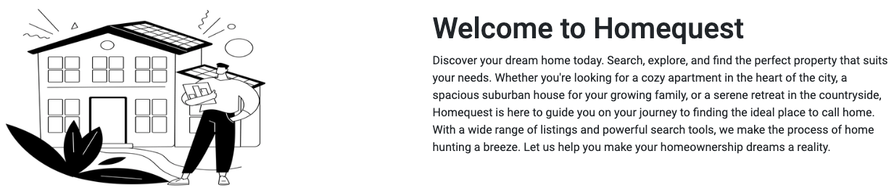

2. **Latest Properties Section**:
   The homepage prominently features the latest properties added to Homequest,
   offering visitors a glimpse of the newest additions to the website.
    - [x] The section accurately showcases the 8 new properties recently added
      to the platform.
      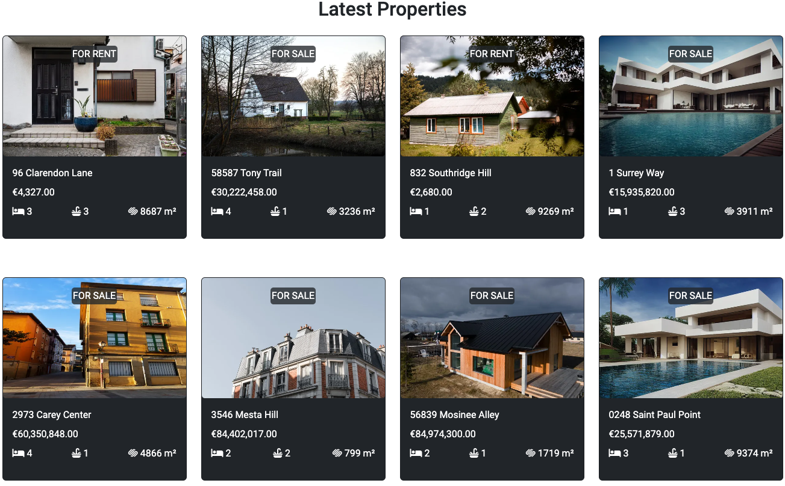

#### **AllAuth Implementation**

'As a Developer, I want to integrate Django AllAuth into the Homequest website
to manage user authentication and registration seamlessly. Additionally, I need
to customize the templates to ensure a consistent and branded user experience.'

The website features AllAuth implementation, providing users with easy access
to login and register functionalities. Relevant tests have been preset on the
login and register pages for improved functionality.

#### **Bootstrap Toast Django Implementation**

'As a Developer, I want to enhance the user experience on the Homequest website
by integrating Bootstrap Toast to display Django messages in a visually
appealing and user-friendly manner.'

Various features on the Homequest website incorporate the use of Bootstrap
Toast messages to provide users with clear and visually appealing feedback. The
following scenarios include the implementation of toast messages, and thorough
testing has been conducted to ensure their effectiveness:

1. **Login Error:**
   If a user enters misleading information during login, an error message will
   be displayed.

   
2. **Registration Error:**
   Similarly, during registration, an error message will be shown in case of
   issues.

   
3. **Payment Errors:**
   In the event of a problem with Stripe payment, a corresponding error message
   will be displayed.

   
4. **Property Already Rented:**
   When a user attempts to rent an already rented property, an error message
   will inform them.

   
5. **Order Completed:**
   After a successful completion of a rent order, a confirmation message will
   be displayed.

   
6. **Contract Termination:**
   If a user terminates a rent contract, a toast message will confirm the
   action.

   
7. **Agent Messaging:**
   When a user sends a message to an agent via the built-in email form, a
   success message will appear.

   
8. **Agent Email Form Error:**
   In case of an error with the agent email form, an appropriate message will
   be displayed.

   
9. **Property Creation:**
   Upon the creation of a new property, a success message will notify the user.

   
10. **Property Image Deletion:**
    When a property image is deleted, a confirmation message will be shown.

    
11. **Property Deletion:**
    Upon deleting a property, a confirmation message will be displayed.

    

#### **NavBar**

'As a User, I want to have easy access to the most important topics on the
Homequest website through a navigation bar. This will allow me to quickly
navigate to key sections such as Buy, Rent, Agents, About, Your Contracts, and
Account, enhancing the overall user experience.'

Tests were conducted on the website's navbar to ensure its functionality,
covering the following aspects:

- **Responsive Design:**
  The navbar was tested across various devices and screen sizes to ensure a
  seamless and responsive user experience. This involved checking for proper
  layout adjustments and optimal display on different devices.

- **Link Functionality:**
  Each link in the navbar was thoroughly tested to ensure correct navigation.
  This involved clicking on each link and verifying that it directs users to
  the intended pages without errors.

- **Icon Visibility:**
  Icons within the navbar were checked to ensure proper visibility. This
  included verifying that icons associated with menu items or actions are
  displayed appropriately, contributing to a visually cohesive design.

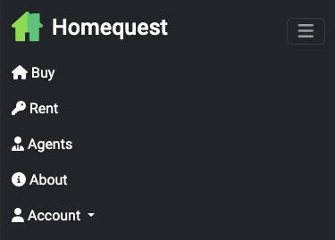

The testing process involved a meticulous examination of these elements to
guarantee a robust and user-friendly navbar experience.

#### **Footer**

'As a User, I want to find a footer on the Homequest website containing a brief
description of the company and a link to its Facebook social media page. This
will provide me with additional information about the company and the
opportunity to connect on social media.'

Similar to the navbar, the footer has undergone thorough testing to ensure:

- **Responsive Design:**
  The footer was tested across various devices and screen sizes to ensure a
  seamless and responsive user experience. This involved checking for proper
  layout adjustments and optimal display on different devices.

- **Link Functionality:**
  Each link in the footer was thoroughly tested to ensure correct navigation.
  This involved clicking on each link and verifying that it directs users to
  the intended pages without errors.

- **Icon Visibility:**
  Icons within the footer were checked to ensure proper visibility. This
  included verifying that icons associated with menu items or actions are
  displayed appropriately, contributing to a visually cohesive design.

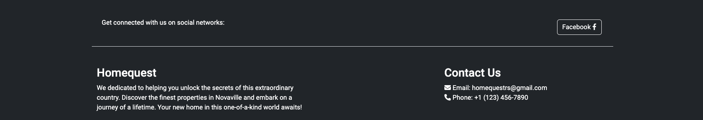

#### **Properties**

'As a User, I want the ability to view properties that are for sale and for
rent on separate pages of the Homequest website. This will enable me to easily
find and explore the relevant property listings based on my specific
interests.'

Testing has been conducted on key aspects of the properties section to ensure a
seamless user experience:

- **Properties Filter:**
  The filtering functionality has been thoroughly tested, allowing users to
  refine property listings based on specific criteria such as type, location,
  and price range.

- **Properties View:**
  The overall view of properties has been tested to ensure a visually appealing
  and user-friendly display. This includes the presentation of property
  details, images, and relevant information.

- **Property Details:**
  Users can open specific properties to access more details. Testing has been
  conducted to guarantee that users can seamlessly navigate and explore
  in-depth information about each property.

- **Pagination:**
  Pagination functionality has been tested to ensure smooth navigation between
  multiple pages of property listings. This allows users to easily move through
  the available properties and find the ones of interest.

This testing process aims to enhance the usability of the properties section,
ensuring that users can effortlessly find, filter, and explore the listings
that match their preferences.

#### **Edit and Create Property**

'As an Agent, I want the capability to edit the details of an existing property
on the Homequest website. This will empower me to keep property information
up-to-date, including images, title, description, and other relevant details.'

'As an Agent, I want the ability to create new property listings on the
Homequest website. This will empower me to add fresh listings with accurate
details, including images, title, description, price, and location.'

The following aspects of the edit property
functionality have undergone thorough testing:

- **Edit Property Details:**
  Testing has been conducted to verify the seamless editing of various property
  details, including but not limited to images, title, description, and other
  relevant information.

- **Delete Image:**
  The ability to delete property images has been tested to ensure that agents
  can easily manage and update the visual representation of the property.

- **Add Image:**
  Testing has been carried out to confirm that agents can effortlessly add new
  images to a property, enhancing its visual presentation.

- **Restricted Access:**
  Access to the edit property functionality is restricted to staff members
  only. Testing ensures that unauthorized users do not have access to this
  critical feature, maintaining the security and integrity of property data.

This comprehensive testing approach aims to provide agents with a user-friendly
and secure environment for efficiently managing and updating property details
on the Homequest website.

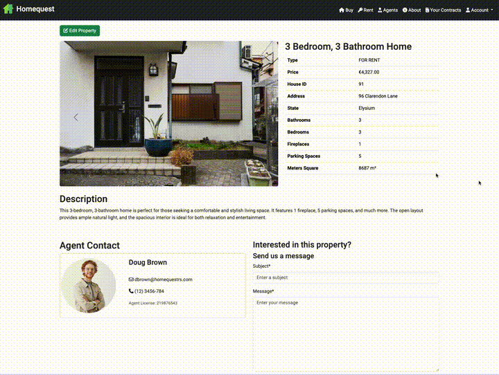
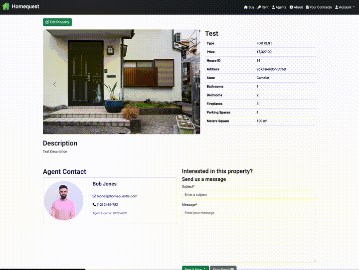
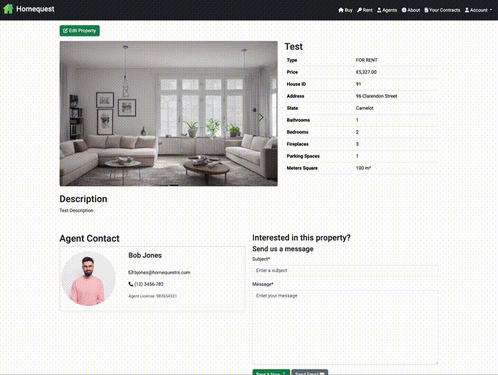

#### **Agents Page**

'As a User, I want to be able to access information about the agents working
for the Homequest company. This will enable me to learn more about the
individuals representing the company and potentially contact them for
assistance.'

The following tests have been conducted to ensure the functionality and user
experience of this page:

The tests below have been done in order to guarantee the page:

- **Agents Page Display:**
  Verification has been done to ensure that the Agents page is correctly
  displayed, providing users with easy access to information about the
  professionals representing Homequest.

- **Agent Information Display:**
  Testing guarantees that relevant information about each agent is accurately
  displayed, allowing users to learn more about the individuals representing
  the company.

- **Responsive Design:**
  The page has been rigorously tested to ensure that it is responsively
  designed, providing a consistent and visually appealing layout across various
  devices and screen sizes.

- **Contact Options Display:**
  Users are provided with contact options for each agent. Testing has been
  conducted to confirm that these contact options are correctly displayed,
  enabling users to easily reach out for assistance.

This testing process aims to enhance the user's ability to learn more about
Homequest's agents, promoting a user-friendly and informative experience on the
Agents page.

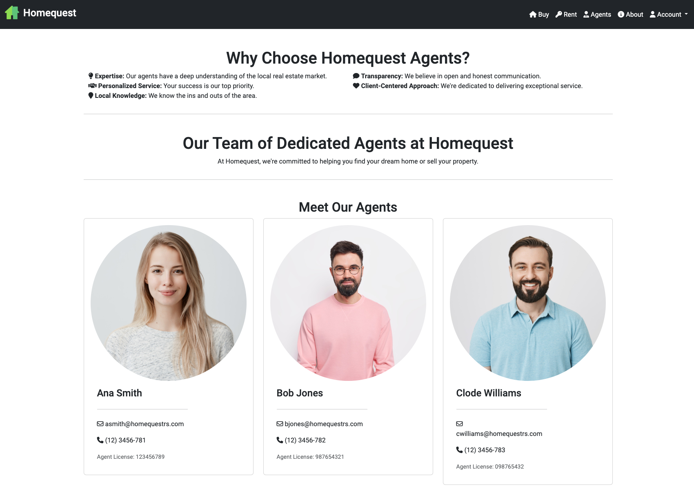
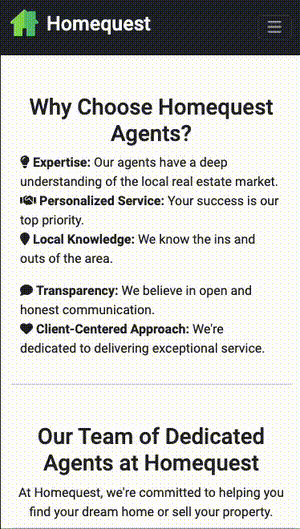

#### **About Page**

'As a User, I want to learn more about the Homequest company and its
background. This will provide me with insights into the company's mission,
values, and history.'

The tests below have been done in order to guarantee the page:

- **About Page Display:**
  Verification has been done to ensure that the Agents page is correctly
  displayed, providing users with easy access to information about the
  professionals representing Homequest.

- **Correct Top Video Positioning:**
  Testing confirms that the top video on the About Page is correctly positioned
  at the top of the page, contributing to an engaging and visually appealing
  introduction to Homequest.

- **Responsive Design:**
  Rigorous testing has been carried out to ensure that the About Page is
  responsively designed, offering a consistent and visually appealing layout
  across various devices and screen sizes.

This thorough testing process aims to guarantee a positive and informative user
experience on the About Page, providing users with valuable insights into
Homequest's mission, values, and history.

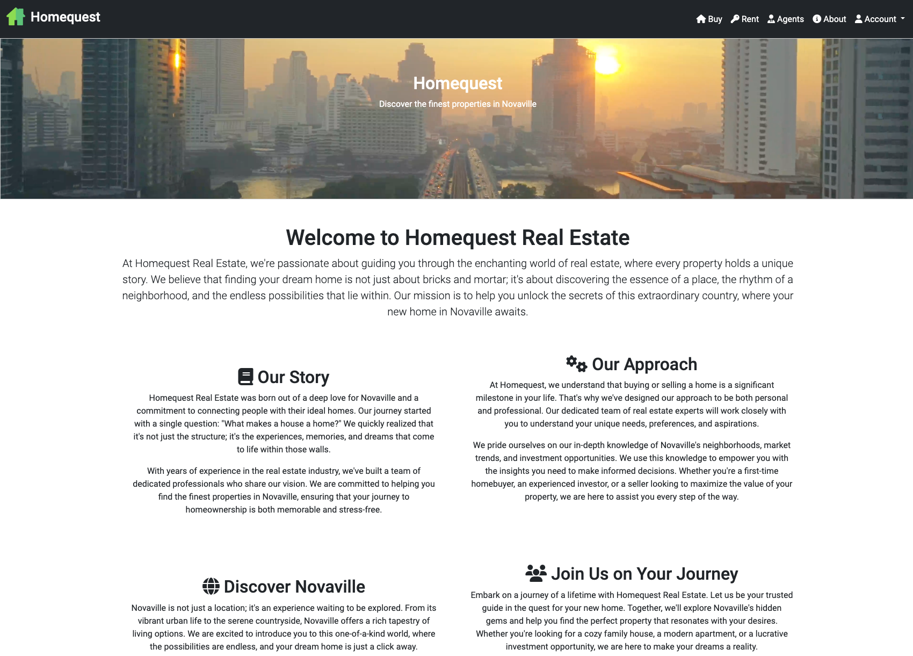
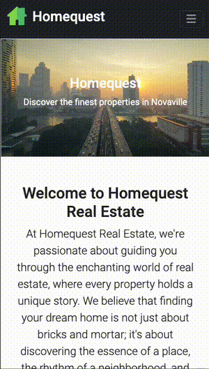

#### **Payment**

'As a User, I want the ability to seamlessly process a payment via Stripe to
rent a property on the Homequest website. This will provide a convenient and
secure way for me to complete the rental transaction.'

The following tests have been conducted to ensure the
payment function operates smoothly:

- **Rent a Property Form:**
  Testing has been implemented for the rent a property form, ensuring that it
  correctly requests the necessary credit card information from users.

- **Credit Card Validation:**
  If the form is filled correctly with a test card provided by the Stripe
  documentation, the website registers the order.

- **Order Registration:**
  After successful validation, testing confirms that the website registers the
  order, marking the completion of the rental transaction.

- **Success Message Display:**
  Once the order is registered, a success message is displayed along with
  details of the rental contract on the page.

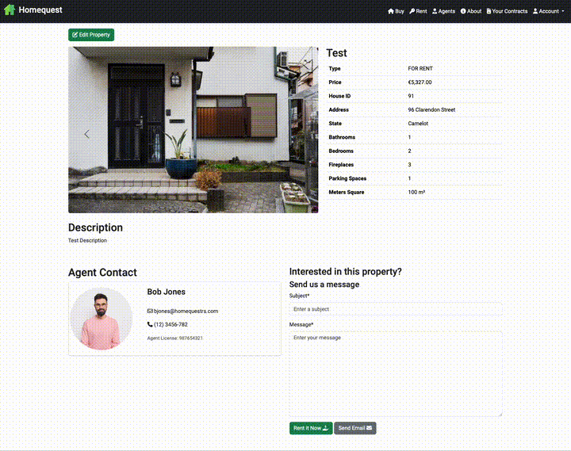

#### **Terminate Contract**

'As a User, I want the ability to terminate a rental contract on the Homequest
website. This will provide me with a straightforward process to end my rental
agreement when needed.'

The following tests have been conducted to ensure the
contract termination operates smoothly:

- **Contract Termination Confirmation:**
  When a user clicks to terminate the contract, testing has been conducted to
  ensure a confirmation step is correctly implemented, providing users with a
  clear and deliberate action.

- **Return to Property Listing:**
  After the contract termination is confirmed, testing verifies that the
  property is successfully returned to the listing, making it available for
  others to rent.

- **Feedback Message:**
  Upon completion of the termination process, users are redirected to home page
  with a feedback message confirming their action. Testing
  ensures that this message is displayed accurately, providing users with
  confirmation of their terminated rental agreement.

These tests aim to guarantee a straightforward and user-friendly experience for
terminating rental contracts on the Homequest website.

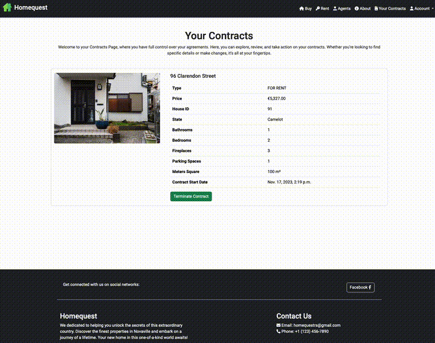

#### **Agent Contact**

'As a User, I want to be able to contact agents easily for inquiries or
assistance related to a specific property. This will provide me with a direct
communication channel to seek more information.'

The following tests have been conducted to ensure the
agent contact operates smoothly:

- **Form Validation:**
  Thorough testing has been implemented to validate the contact form, ensuring
  that all required fields are correctly validated before submission.

- **Email Send:**
  The functionality to send emails through the contact form has been rigorously
  tested, guaranteeing that user inquiries are successfully transmitted to the
  respective agents.

- **Success Message:**
  Upon successful submission of the contact form, users receive a clear success
  message. Testing ensures that this message is displayed accurately, providing
  users with confirmation that their inquiry has been sent.

These tests aim to enhance the user experience by ensuring a reliable and
straightforward communication channel for users to contact agents on the
Homequest website.

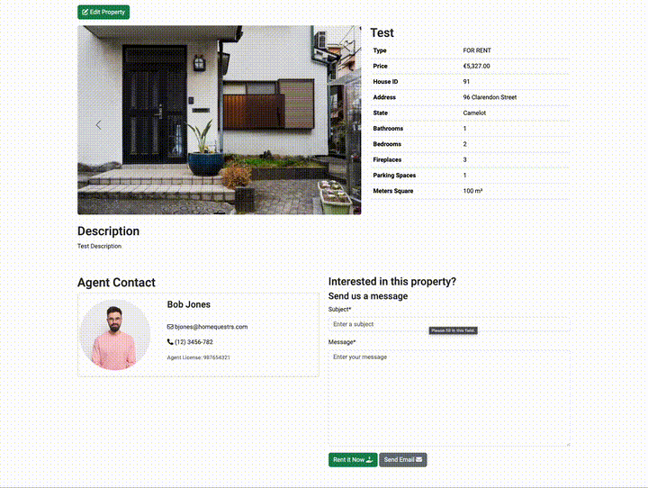
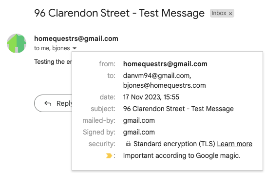

### **Javascript Testing**

#### **Confirmation Buttons**

The confirmation buttons for Property Delete, Image Delete, and Terminate
Contract have undergone testing and have been successfully validated.

#### **Bootstrap Carousel**

The Bootstrap Carousel JS implementation has been thoroughly tested and is
functioning as intended. It correctly displays images and maintains the correct
order.

#### **Bootstrap Toasts**

The Bootstrap Toasts script has been tested and is operational, ensuring that
toast messages are displayed as expected.

#### **Stripe**

The Stripe payment script has undergone testing and has been verified to be
functioning correctly, ensuring a seamless and secure payment process for
users.

These tests collectively contribute to the overall reliability and
functionality of the JavaScript components on the Homequest website.

## **Validators**

### **CI Python Linter**

The [CI Python Linter](https://pep8ci.herokuapp.com/) was employed to validate
the Python code throughout this project.

### **W3C CSS Validator**

[W3C CSS Validator](https://jigsaw.w3.org/css-validator/) was used to validate
the site's CSS code.

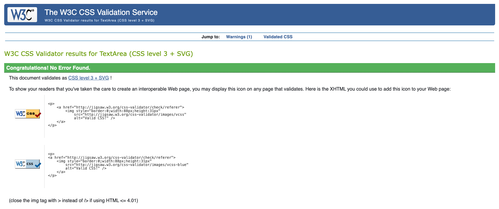

[Back to top &uarr;](#contents)

